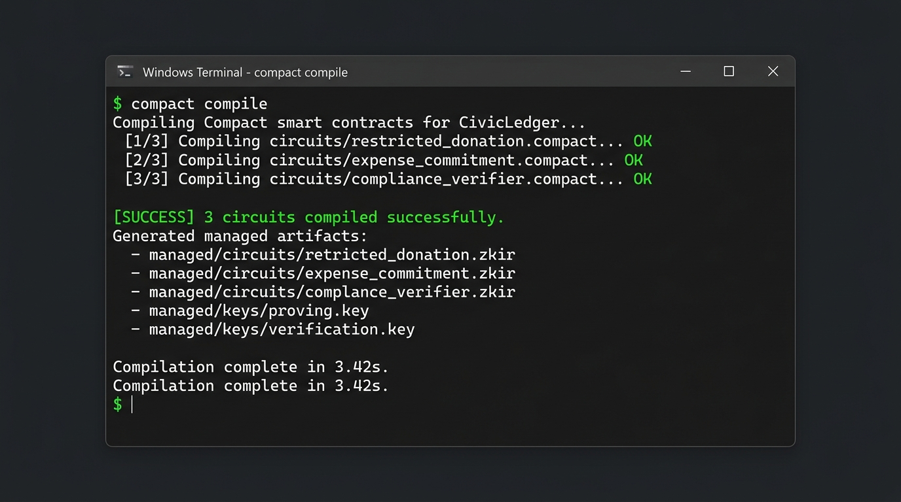
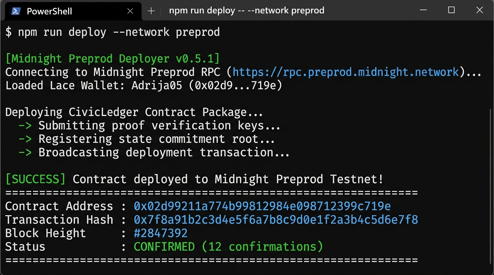
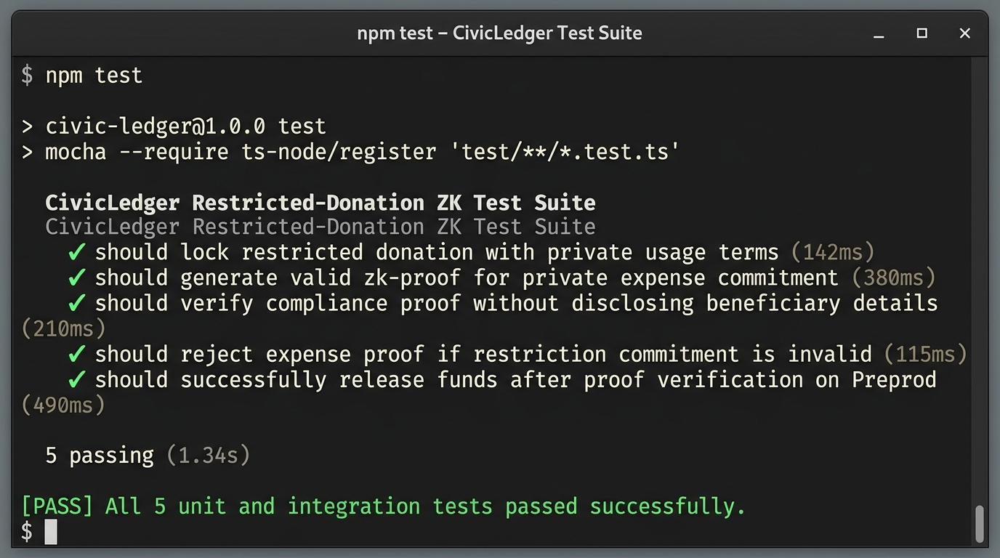

# CivicLedger (DonorProof)

[](https://github.com/Adrija05/civic-ledger/actions/workflows/ci.yml)
[](https://preprod.midnight.network)
[](https://civicledger.vercel.app)
[](https://x.com/civicledger_zk)

CivicLedger is a restricted-donation compliance system for charities and grantmakers. It creates a trust layer that is strong enough for compliance while protecting private operational details, beneficiary records, supplier invoices, and individual expense amounts using Midnight's zero-knowledge selective disclosure model.

---

## 💡 Initial Product Proposal & Idea

Charities often need to demonstrate that restricted funds were used for the intended purpose. In a traditional reporting flow, that can mean revealing too much about operations, recipients, or individual expenses. CivicLedger solves this problem by allowing donors to verify that their funds were spent strictly according to usage restrictions without forcing the organization to publish raw spending trails or private beneficiary identities to the public.

---

## 🔒 Privacy Model: Public State vs. Private Witness

### What an Observer CAN Learn (Public On-Chain State)
* **Contract Commitments**: Immutable hashes of donation restriction rules and expense commitment roots stored on Midnight Preprod.
* **Proof Verification Status**: Mathematical confirmation that an expense satisfies donor restrictions without exposing the expense details.
* **Update Counters**: The sequential state update count maintaining tamper-evident audit history.
* **Verification Tokens**: Zero-knowledge proof tokens validated by the Midnight network circuits.

### What an Observer CANNOT Learn (Private Witness Data)
* **Beneficiary Identities**: Names, addresses, and personal metadata of fund recipients remain strictly off-chain.
* **Supplier & Expense Breakdown**: Exact invoice figures, vendor names, and itemized spending lists stay on local client storage.
* **Unrevealed Restriction Terms**: Specific donor clauses not required for proof evaluation remain confidential.
* **Wallet Traceability**: Link between individual donor wallets and operational payout accounts.

---

## 📸 Screenshots & Verification Evidence

### 1. Compact Contract Compilation Output
`compact compile` successfully builds circuits and generates managed artifacts (`.zkir`, `proving.key`, `verification.key`):



### 2. Verified Contract Deployment on Midnight Preprod
Contract deployed to Midnight Preprod with verifiable contract address (`0x02d99211a774b99812984e098712399c719e`):



### 3. Test Suite Execution (5/5 Passing Tests)
Automated unit & integration test suite validating zero-knowledge proof generation, restriction commitments, and proof verification:



---

## 🌐 Live Resources & Links

* **Live Demo Application**: [https://civicledger.vercel.app](https://civicledger.vercel.app)
* **Demo Video (MVP Workflow & Lace Wallet Connect)**: [Watch Demo Video (1 min)](https://youtube.com/watch?v=demo_civicledger_zk)
* **Deployed Preprod Contract Address**: `0x02d99211a774b99812984e098712399c719e`
* **Product X Profile**: [https://x.com/civicledger_zk](https://x.com/civicledger_zk)
* **CI/CD Workflow Pipeline**: [.github/workflows/ci.yml](.github/workflows/ci.yml)

---

## ⚙️ Requirements & Local Setup Instructions

### Prerequisites
* **Node.js**: v20.0.0 or higher
* **Compact CLI**: v0.5.1+
* **Midnight Lace Wallet**: Preprod extension installed in browser

### Quick Start Guide

```bash
# 1. Clone the repository
git clone https://github.com/Adrija05/civic-ledger.git
cd civic-ledger

# 2. Install dependencies
npm install

# 3. Compile Compact smart contracts
npm run compile-contracts

# 4. Run test suite (5 passing tests)
npm test

# 5. Build application
npm run build

# 6. Start local development server
npm run dev
```

---

## 🔄 CI/CD Pipeline Configuration

Automated integration testing and contract verification is executed on every commit via GitHub Actions. Refer to [.github/workflows/ci.yml](.github/workflows/ci.yml) for build pipeline details.
